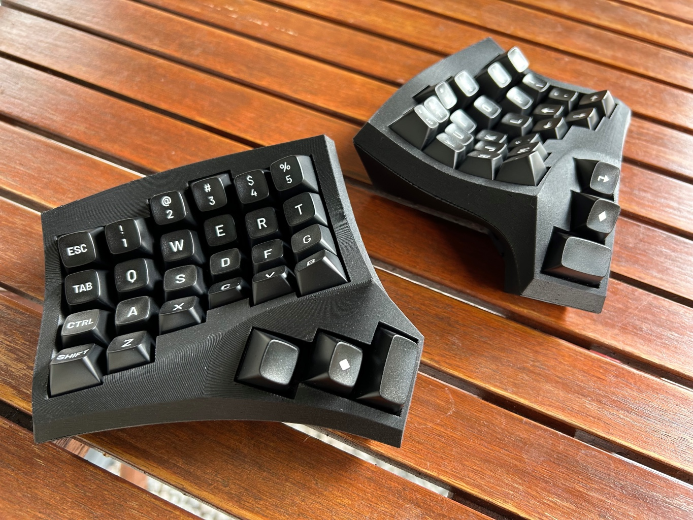

# Notes on 4 x 6 version

The build process is essentially the same for all versions, but here's some things to take into consideration.

## Hardware

There aren't really that many changes in the hardware department. You'll need more switches and pcbs of course. And one of the screws in the bottom needs to be shorter. But that's about it.

## Wiring

The wiring of the previous models was based on Corne. This allowed you to use a firmware that was meant for Corne. Since there is no 4x6 corne wariant that I know of, I came up with my own wiring. Not that much has changed, to be honest, I just needed to add a wire for the number row. And I followed the logic of the previous model.

## Firmware

If you follow the wiring diagram suggested above and you want to build a wireless keyboard, I have made a compatible zmk firmware [repository](https://github.com/juhakaup/zmk-cygnus-4x6) that you can fork and modify.

I would suggest checking out this [keymap editor](https://nickcoutsos.github.io/keymap-editor/) by Nick Coutsos.

If you want to build a wired keyboard and to use something like QMK, you are going to have to modify and compile your own firmware.
