# Dactyl Cygnus

Dactyl Cygnus is a minimalist 36-key ortholinear split keyboard. It draws inpiration from the dactyl-manuform style keyboards and offers improved ergonomics throught the ability to angle the sides to a more natural  an by having a concave keywell for more natural position and movement of the hands and fingers.

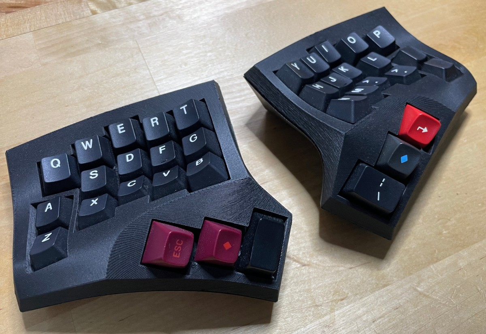

## Build video
I made  a video about building the keyboard.
<a href="https://youtu.be/h_ex-oMVOrI">
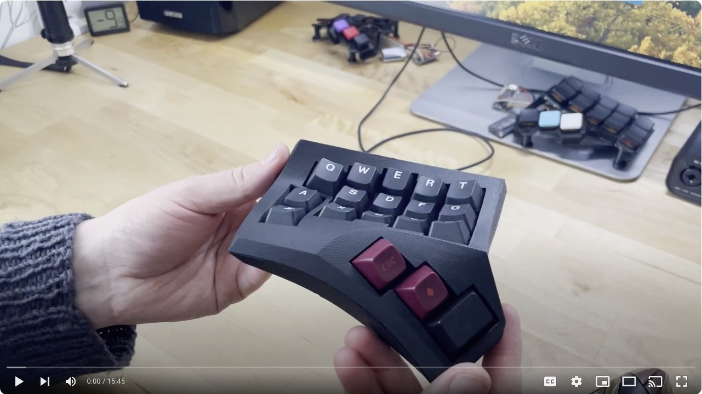
</a>

## Variants
I've made a few variations of the design. 

A lot of people asked for the 6 column version of the keyboard. Personally I'm used to 5 columns, so I haven't done extensive testing on the layout. I hope that it is adequate, but I'm also open to feedback.

Both of the layouts also have a version with uniform pinky columns. I use my ring finder for the topmost keys, so that's why they are grouped with the other columns. This of course doesn't suit everyone, so you can use the unicol -versions if that fits your typing habbits.

I also made a version of the case that is designed for wireless builds. This version replaces the TRRS-socket with a switch for disconnecting the battery. The wireless version supports a switch with specific dimensions and a [supermini](https://github.com/joric/nrfmicro/wiki/Alternatives#supermini-nrf52840) controller. 

<table>
    <tr>
        <td>
        3x5  
        <a href="https://github.com/juhakaup/keyboards/blob/main/Cygnus%20v1.0/img/3x5_wireless.jpg">
        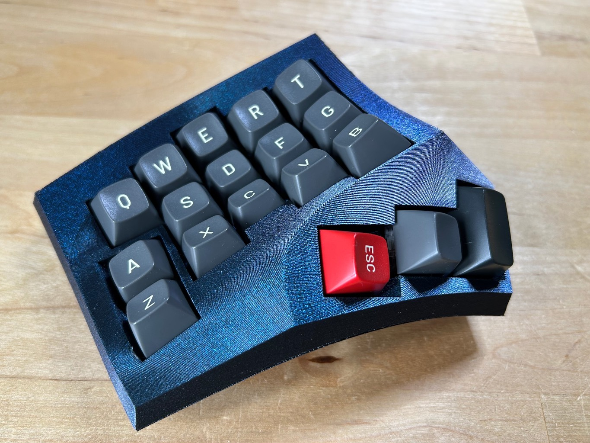
        </a>
        </td>
        <td>
        3x6  
        <a href="https://github.com/juhakaup/keyboards/blob/main/Cygnus%20v1.0/img/3x6_draft.jpg">
        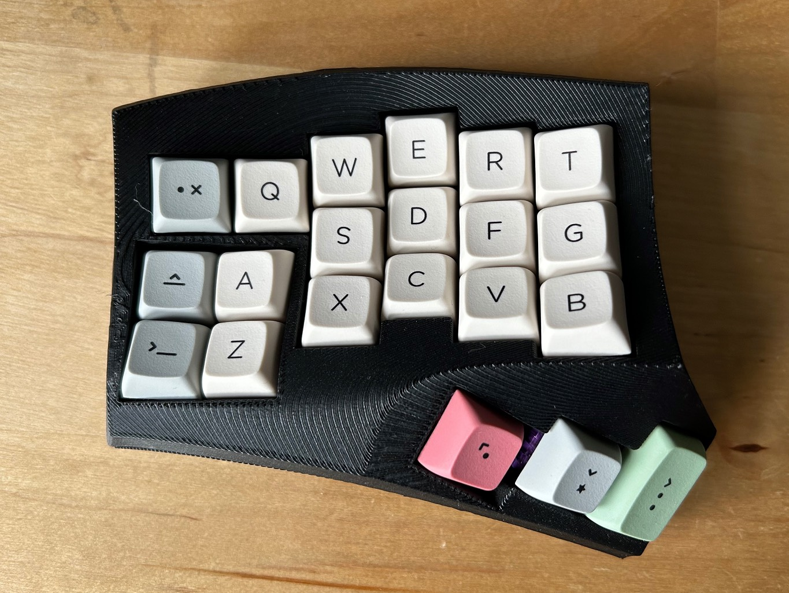
        </a>
        </td>
    </tr>
    <tr>
        <td>
        Unicolumn  
        <a href="https://github.com/juhakaup/keyboards/blob/main/Cygnus%20v1.0/img/unicol_draft.jpg">
        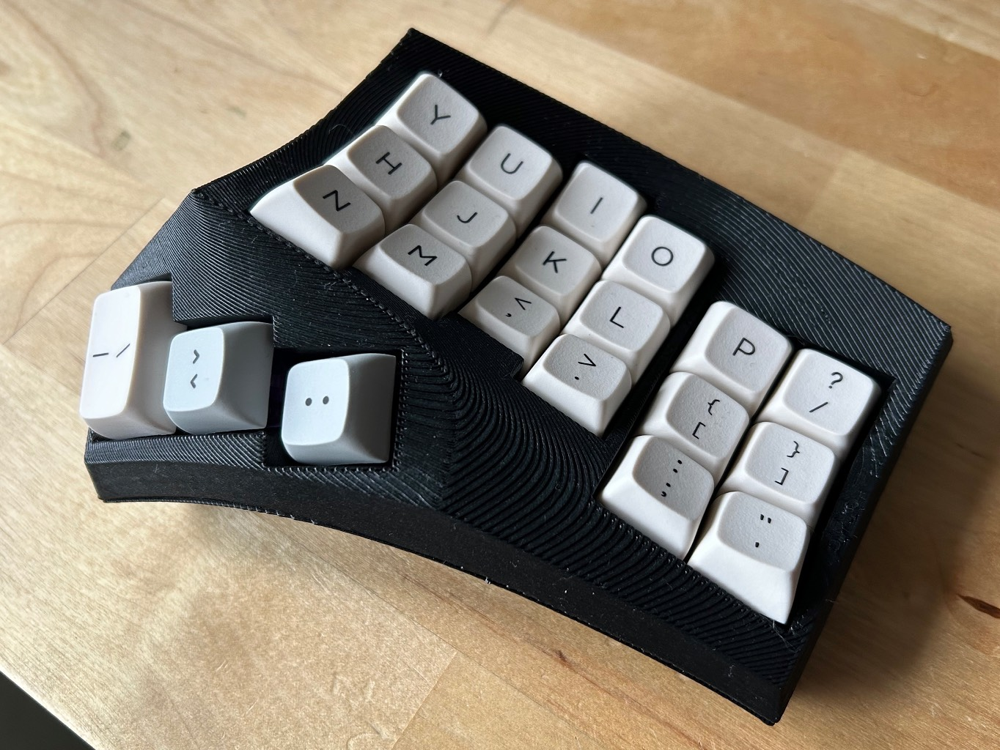
        </a>
        </td>
        <td>
        Wireless  
        <a href="https://github.com/juhakaup/keyboards/blob/main/Cygnus%20v1.0/img/wireless.jpg">
        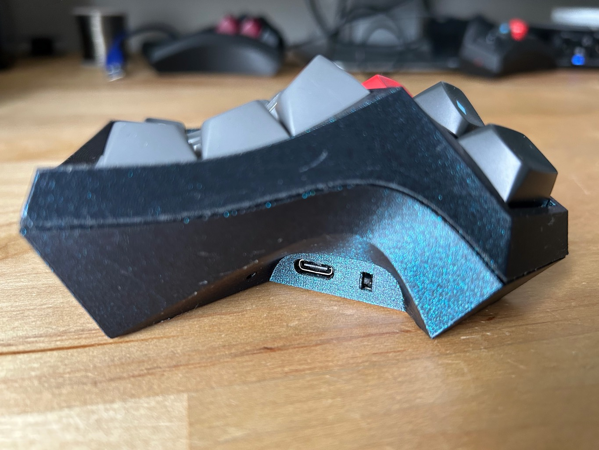
        </a>
        </td>
    </tr>
</table>

## Parts

### 3D printed parts
Each side of the case consists of four 3d printed parts. Two larger halves and two small brackets for holding the controller. All 3d printed parts are the same for both sides of the keyboard, just mirrored in slicing software for the other side.

So for each halve you need:
* Case top
* Case bottom
* Pair of brackets to fit your controller

<a href="https://github.com/juhakaup/keyboards/blob/main/Cygnus%20v1.0/img/casetop.jpg">
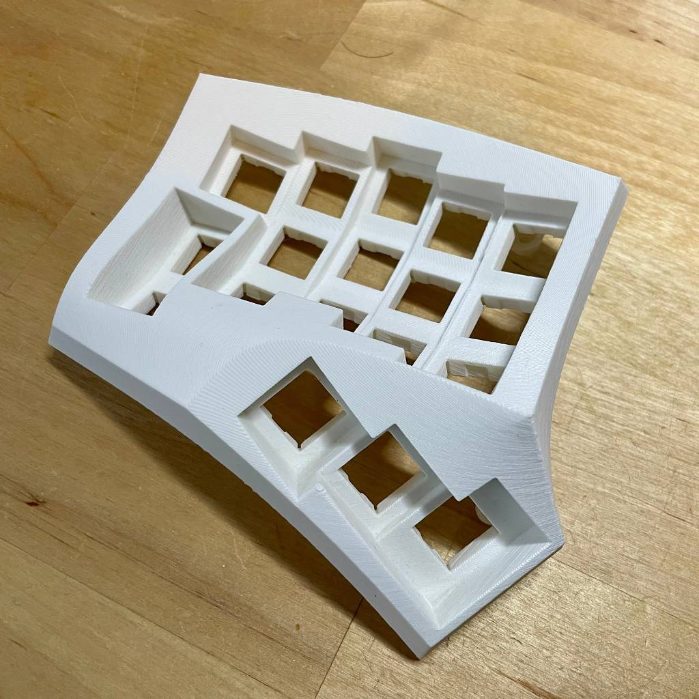
</a>
<a href="https://github.com/juhakaup/keyboards/blob/main/Cygnus%20v1.0/img/casebottom.jpg">
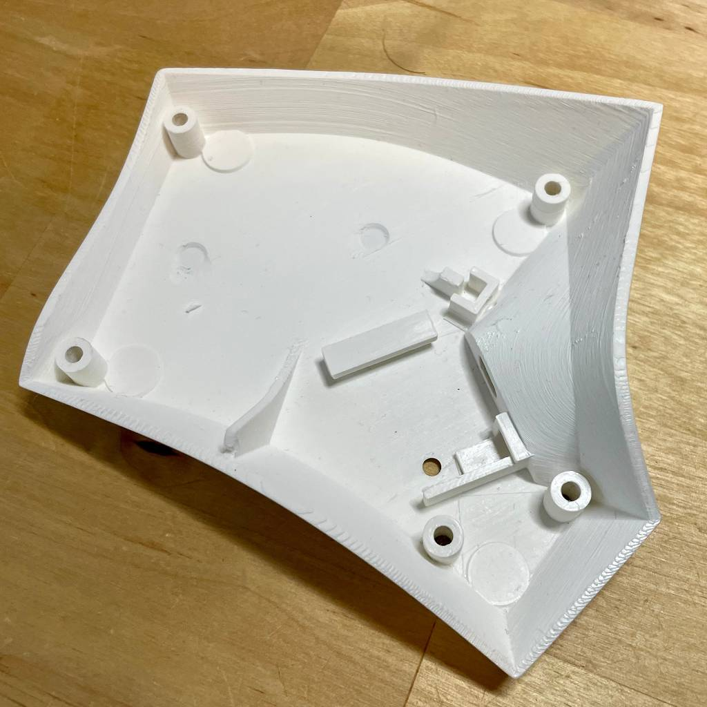
</a>
<a href="https://github.com/juhakaup/keyboards/blob/main/Cygnus%20v1.0/img/casebrackets.jpg">
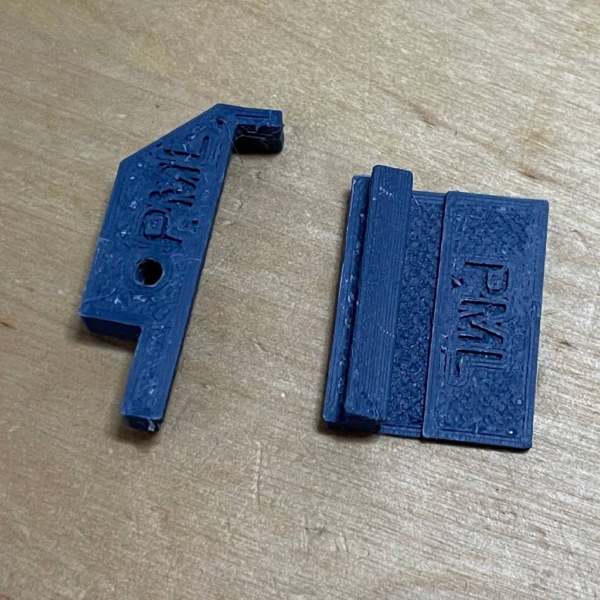
</a>

I usually print with 0.15mm layer height and set the number of perimeters to 4. This should result in parts that are rigid and look relatively smooth. Using 0.2mm layer height should be fine as well, but the layers will be more visible. Using matte filament may result in smoother looking prints.

### Controller brackets
The controller is held in place by slotting it between the two brackets. This way differently sized controllers can be used without modifying the case. Printing the brackets only takes few minutes, so modifying them to find a good fit is quite easy.

I've pre-made a few brackets to support various popular controllers. Such as the Elite-C, RP2040-zero and a couple of pro-micro clones that I had laying around.

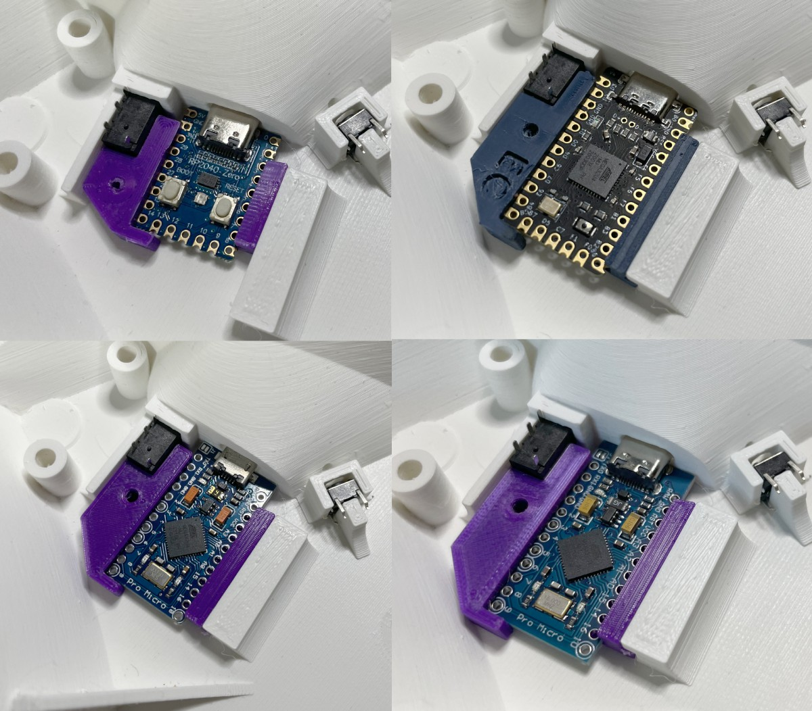

### Components
<table>
    <tr>
        <th>Count</th>
        <th>Part</th>
        <th>Img</th>
        <th>Info</th>
        <th>Links</th>
    </tr>
    <tr>
        <td>2</td>
        <td>Controllers</td>
        <td><a href="https://github.com/juhakaup/keyboards/blob/main/Cygnus%20v1.0/img/parts/controllers.jpg">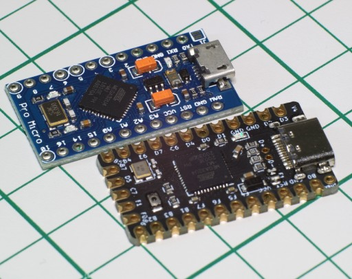</a></td>
        <td>Pro micro or similar</td>
        <td><a href="https://42keebs.eu/products/parts/controllers/">42keebs</a> <a href="https://www.aliexpress.com/item/32887074671.html?spm=a2g0o.order_list.order_list_main.47.427f1802y785t8">aliexpress</a></td>
    </tr>
    <tr>
        <td>36</td>
        <td>Diodes</td>
        <td><a href="https://github.com/juhakaup/keyboards/blob/main/Cygnus%20v1.0/img/parts/diodes.jpg">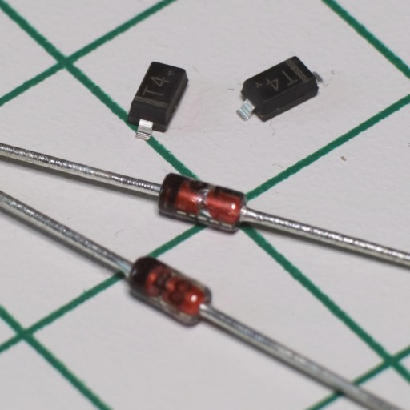</a></td>
        <td>1N4148 signal diode.   Through-hole or SMD</td>
        <td><a href="https://42keebs.eu/shop/parts/components/1n4148-diodes-through-hole-smd/">42keebs</a> <a href="https://www.aliexpress.com/item/32948518338.html?spm=a2g0o.order_list.order_list_main.37.427f1802y785t8">aliexpress</a></td>
    </tr>
    <tr>
        <td>36</td>
        <td>Sockets</td>
        <td><a href="https://github.com/juhakaup/keyboards/blob/main/Cygnus%20v1.0/img/parts/sockets.jpg">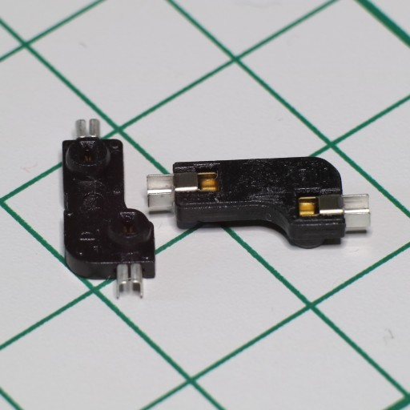</a></td>
        <td>MX style</td>
        <td><a href="https://42keebs.eu/shop/parts/kailh-mx-hot-swap-sockets/">42keebs</a> <a href="https://www.aliexpress.com/item/1005003873653184.html?spm=a2g0o.order_list.order_list_main.42.427f1802y785t8">aliexpress</a></td>
    </tr>
    <tr>
        <td>2</td>
        <td>Reset switches</td>
        <td><a href="https://github.com/juhakaup/keyboards/blob/main/Cygnus%20v1.0/img/parts/resetsw.jpg">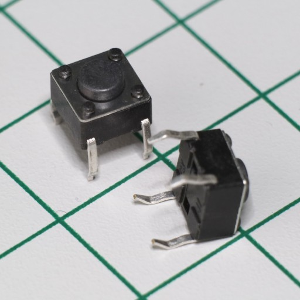</a></td>
        <td>6x6x4.3mm</td>
        <td><a href="https://42keebs.eu/shop/parts/components/reset-switch/?attribute_type=Through-hole%204-pin%206x6&attribute_pa_colour=black">42keebs</a> <a href="https://www.aliexpress.com/item/1005004159746274.html?spm=a2g0o.order_list.order_list_main.92.427f1802y785t8">aliexpress</a></td>
    </tr>
    <tr>
        <td>2</td>
        <td>TRRS socket</td>
        <td><a href="https://github.com/juhakaup/keyboards/blob/main/Cygnus%20v1.0/img/parts/trrs.jpg">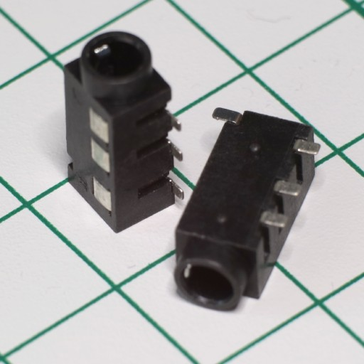</a></td>
        <td>3.5 mm socket</td>
        <td><a href="https://42keebs.eu/shop/parts/components/pj-320-trrs-socket/">42keebs</a> <a href="https://www.aliexpress.com/item/32368285821.html?spm=a2g0o.productlist.main.5.44ac366b6gVcys&algo_pvid=eb8dc301-7746-4e38-bb39-5202fee305b4&algo_exp_id=eb8dc301-7746-4e38-bb39-5202fee305b4-2&pdp_npi=4%40dis%21EUR%211.82%211.82%21%21%211.91%211.91%21%402101c5c217080957493368964ee848%2156855368113%21sea%21FI%212680577757%21&curPageLogUid=rsQi3MeIBm7u&utparam-url=scene%3Asearch%7Cquery_from%3A">aliexpress</a></td>
    </tr>
    <tr>
        <td>36</td>
        <td>Single-switch pcbs</td>
        <td><a href="https://github.com/juhakaup/keyboards/blob/main/Cygnus%20v1.0/img/parts/pcb.jpg">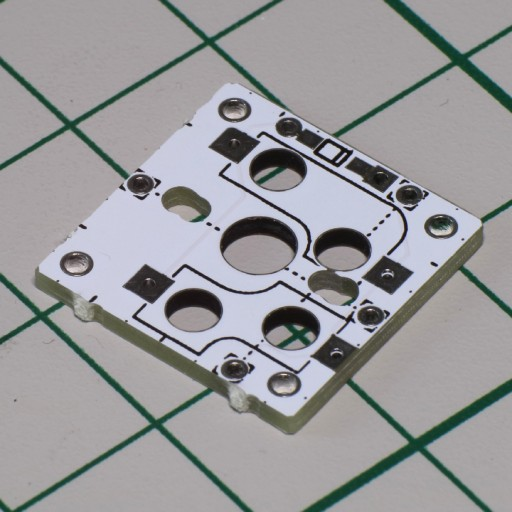</a></td>
        <td>See section about pcbs</td>
        <td></td>
    </tr>
</table>

### Hardware
<table>
    <tr>
        <th>Count</th>
        <th>Part</th>
        <th>Img</th>
        <th>Info</th>
        <th>Links</th>
    </tr>
    <tr>
        <td>10</td>
        <td>Machine screws</td>
        <td><a href="https://github.com/juhakaup/keyboards/blob/main/Cygnus%20v1.0/img/parts/mscrews.jpeg">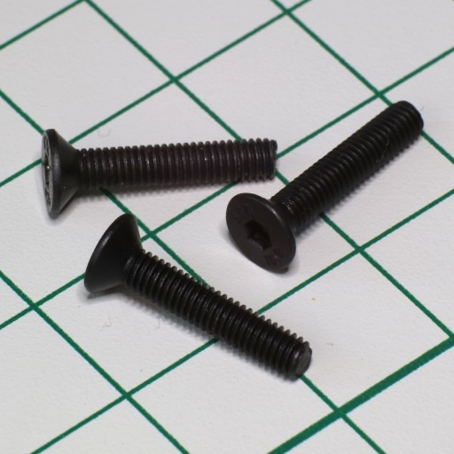</a></td>
        <td>Counter sunk m3x16mm</td>
        <td><a href="https://www.aliexpress.com/item/1005002365855820.html?spm=a2g0o.productlist.main.7.19374fb453UU9W&algo_pvid=d3018e7a-0d94-47e5-b214-c7d4407ae2b3&aem_p4p_detail=202306210411035333550415995000004228660&algo_exp_id=d3018e7a-0d94-47e5-b214-c7d4407ae2b3-3&pdp_npi=3%40dis%21EUR%214.02%213.02%21%21%21%21%21%40211bd7bf16873458636567749d0c55%2112000020338110202%21sea%21FI%212680577757&curPageLogUid=RYH41z3Cp2Yk&search_p4p_id=202306210411035333550415995000004228660_4/">Aliexpress</a></td>
    </tr>
    <tr>
        <td>2</td>
        <td>Machine screws</td>
        <td></td>
        <td>Counter sunk m3x8mm</td>
        <td><a href="https://www.aliexpress.com/item/1005002365855820.html?spm=a2g0o.productlist.main.7.19374fb453UU9W&algo_pvid=d3018e7a-0d94-47e5-b214-c7d4407ae2b3&aem_p4p_detail=202306210411035333550415995000004228660&algo_exp_id=d3018e7a-0d94-47e5-b214-c7d4407ae2b3-3&pdp_npi=3%40dis%21EUR%214.02%213.02%21%21%21%21%21%40211bd7bf16873458636567749d0c55%2112000020338110202%21sea%21FI%212680577757&curPageLogUid=RYH41z3Cp2Yk&search_p4p_id=202306210411035333550415995000004228660_4/">Aliexpress</a></td>
    </tr>
    <tr>
        <td>72-140</td>
        <td>Screws</td>
        <td><a href="https://github.com/juhakaup/keyboards/blob/main/Cygnus%20v1.0/img/parts/screws.jpg">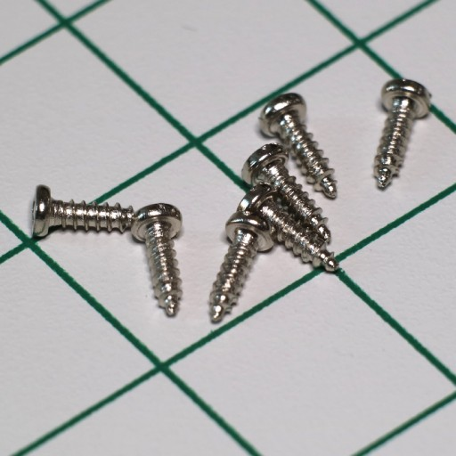</a></td>
        <td>M1.4 x 5mm. At least 2 per pcb.</td>
        <td><a href="https://www.aliexpress.com/item/4000232858343.html?spm=a2g0o.order_list.order_list_main.67.127d1802zRyJj4">Aliexpress</a></td>
    </tr>
    <tr>
        <td>10</td>
        <td>Brass inserts</td>
        <td><a href="https://github.com/juhakaup/keyboards/blob/main/Cygnus%20v1.0/img/parts/brassinsers.jpg">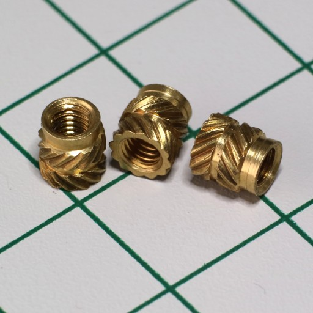</a></td>
        <td>m3 D4.6 L5</td>
        <td><a href="https://www.aliexpress.com/item/4000232858343.html?spm=a2g0o.order_list.order_list_main.67.127d1802zRyJj4">Aliexpress</a></td>
    </tr>
</table>

### Other parts
<table>
    <tr>
        <th>Count</th>
        <th>Part</th>
        <th>Img</th>
        <th>Info</th>
        <th>Links</th>
    </tr>
    <tr>
        <td>36</td>
        <td>Keycaps</td>
        <td></td>
        <td>Larger thumb keys are 1x1.5</td>
        <td></td>
    </tr>
    <tr>
        <td>36</td>
        <td>Switches</td>
        <td><a href="https://github.com/juhakaup/keyboards/blob/main/Cygnus%20v1.0/img/parts/switches.jpg">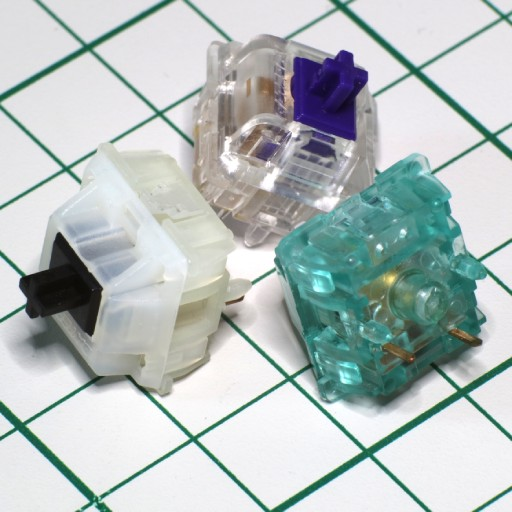</a></td>
        <td>MX style</td>
        <td><a href="https://42keebs.eu/products/switches/">42keebs</a></td>
    </tr>
    <tr>
        <td></td>
        <td>Wire</td>
        <td><a href="https://github.com/juhakaup/keyboards/blob/main/Cygnus%20v1.0/img/parts/wire.jpg">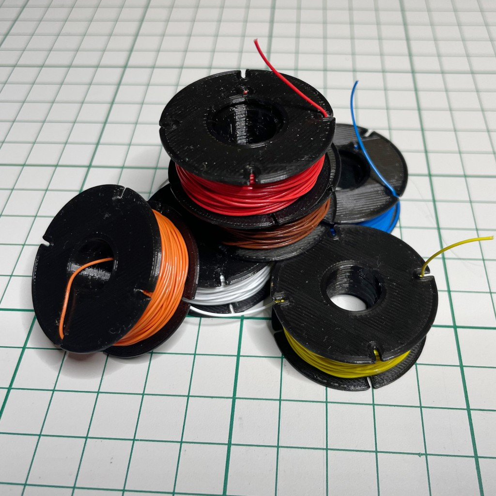</a></td>
        <td>Thin wire. I used 28AWG</td>
        <td><a href="https://www.aliexpress.com/item/1005004874605989.html?spm=a2g0o.order_list.order_list_main.10.427f1802y785t8">aliexpress</a></td>
    </tr>
    <tr>
        <td>1</td>
        <td>TRRS cable</td>
        <td><a href="https://github.com/juhakaup/keyboards/blob/main/Cygnus%20v1.0/img/parts/cable.jpg">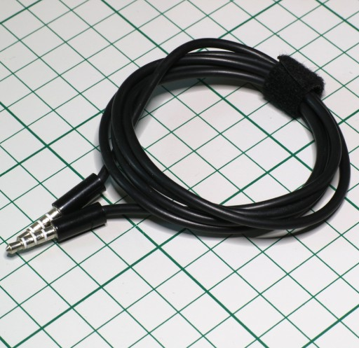</a></td>
        <td>3 or 4 pole TRRS cable  with 3.5mm jacks</td>
        <td><a href="https://42keebs.eu/shop/parts/plain-braided-metal-trrs-cable/">42keebs</a></td>
    </tr>
    <tr>
        <td>10</td>
        <td>Silicone rubber feet</td>
        <td><a href="https://github.com/juhakaup/keyboards/blob/main/Cygnus%20v1.0/img/parts/feet.jpg">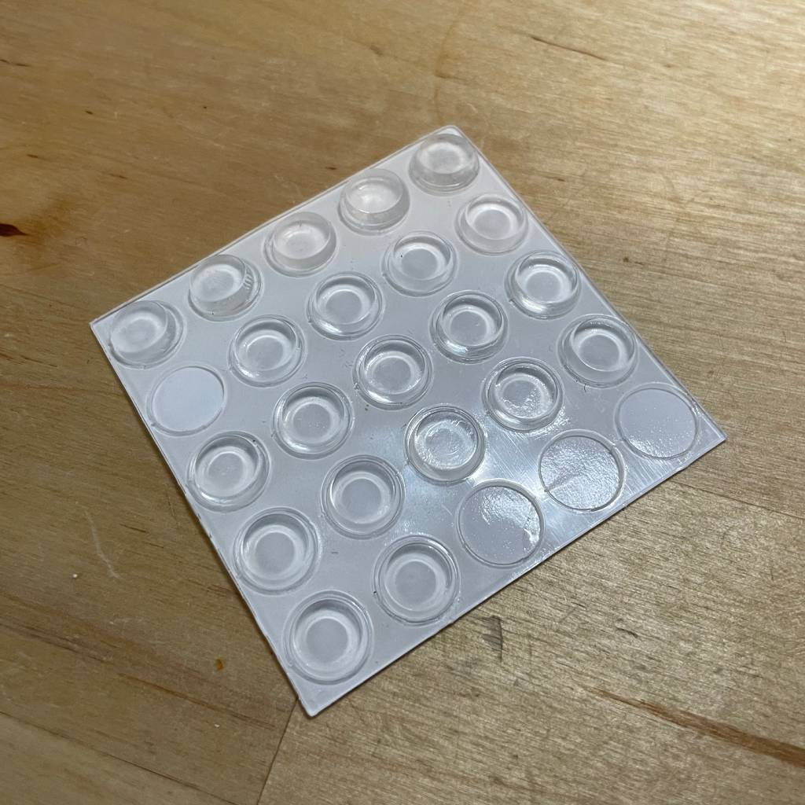</a></td>
        <td>10mm diameter</td>
        <td></td>
    </tr>
</table>

### Wireless version parts
If you are building the wireless version, you don't need the TRRS sockets or the TRRS cable, use the wireless controller instead of the wired alternatives. I used a bit of double sided tape to fix the battery in place.

<table>
    <tr>
        <th>Count</th>
        <th>Part</th>
        <th>Img</th>
        <th>Info</th>
        <th>Links</th>
    </tr>
    <tr>
        <td>2</td>
        <td>Wireless controller</td>
        <td></td>
        <td>NRF52840 Development Board Supermini</td>
        <td><a href="https://www.aliexpress.com/item/1005006035267231.html?spm=a2g0o.order_list.order_list_main.21.33da1802bWUmVz">Aliexpress</a></td>
    </tr>
    <tr>
        <td>2</td>
        <td>Power switch</td>
        <td></td>
        <td>3.7mm x 3.7mm x 8.7mm, 5mm knob</td>
        <td><a href="https://www.aliexpress.com/item/1005003938856402.html?spm=a2g0o.order_detail.order_detail_item.3.2b06f19c8r693T">Aliexpress</a></td>
    </tr>
    <tr>
        <td>2</td>
        <td>Battery</td>
        <td></td>
        <td>A small 3.7v LiPo battery.   I used a 240mah, size: 20mm x 30mm x 7mm </td>
        <td></a></td>
    </tr>
</table>

## Building the keyboard

### Preparing the 3d printed parts

Prepare the 3d printed parts by sanding if needed. At least make sure that the case halves fit together nicely.

Next add the brass inserts to the top halve of the case. You can use a soldering iron for this. Lower the temperature, if possible, I set mine to about 300°C. Getting the inserts straight can be a bit tricky without a proper tool, but it's doable. 

<a href="https://github.com/juhakaup/keyboards/blob/main/Cygnus%20v1.0/img/caseinsert.jpg">
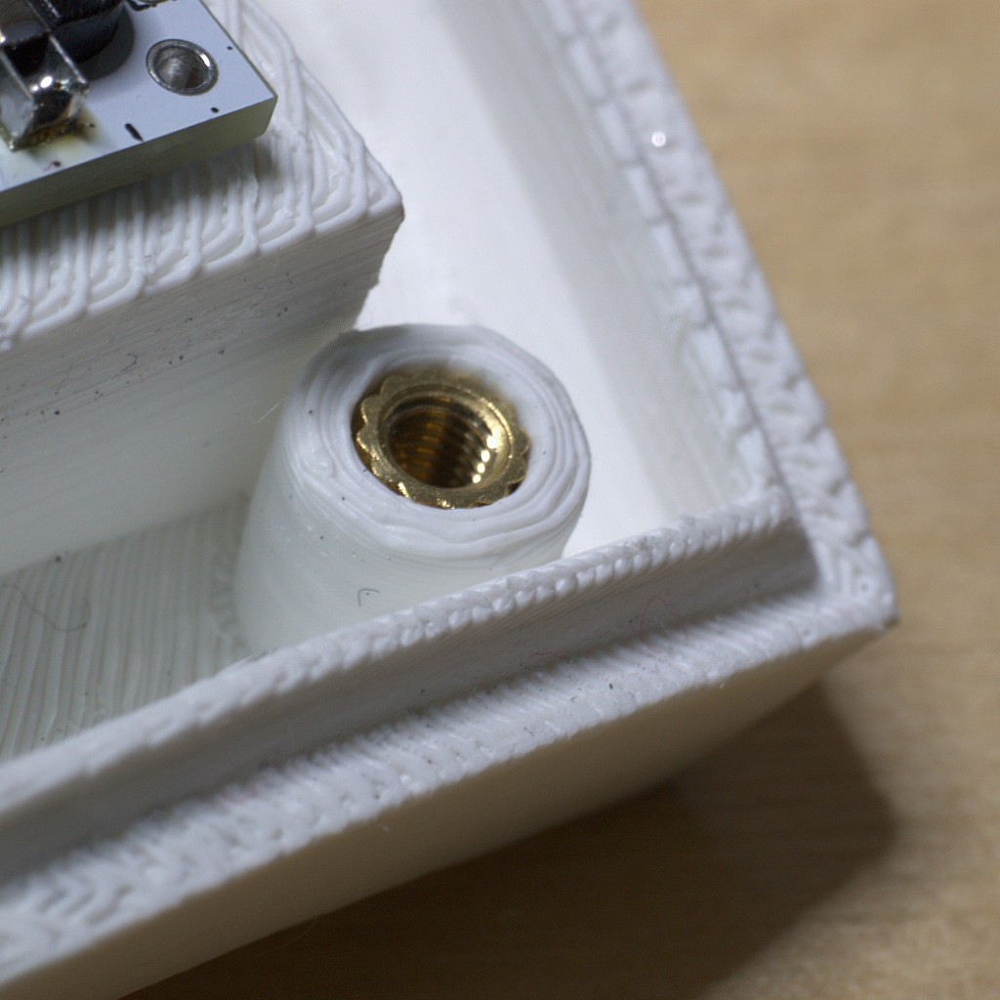
</a>
<a href="https://github.com/juhakaup/keyboards/blob/main/Cygnus%20v1.0/img/caseinserts2.jpg">
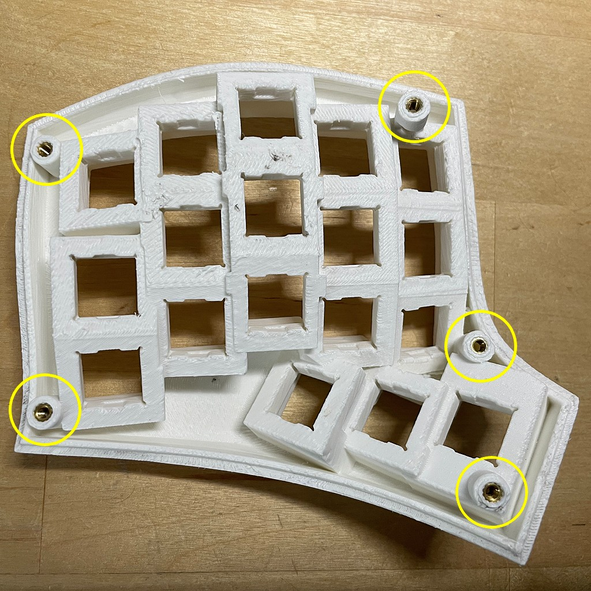
</a>

### Single-switch pcbs

The pcbs are originally from the [su120-keyboard](https://github.com/e3w2q/su120-keyboard). A stripped down version of the pcb was relesed by kissetfall along with the [gerber](https://github.com/kissetfall/su120-keyboard/releases/tag/gerber) files to improve usability on dactyl manuform builds.

Ordering the pcbs from prototype manufacturers such as jlcpcb or pcbway is quite straight forward. All you need is to upload the gerber files and then you can pretty much go with the default settings on the manufacturers website. 

The pcbs come in these 5x5 plates. I usually solder the components first and then separate the individual boards. Remove the tabs from the sides by sanding as the boards won't fit to the case with them.

I recommend using surface mount diodes, but the pcbs do support through hole diodes as well. The side without the components should be flat to avoid interference with case, so you use through hole diodes, solder them from the component side and cut the legs flush.

<a href="https://github.com/juhakaup/keyboards/blob/main/Cygnus%20v1.0/img/pcbsmd.jpg">
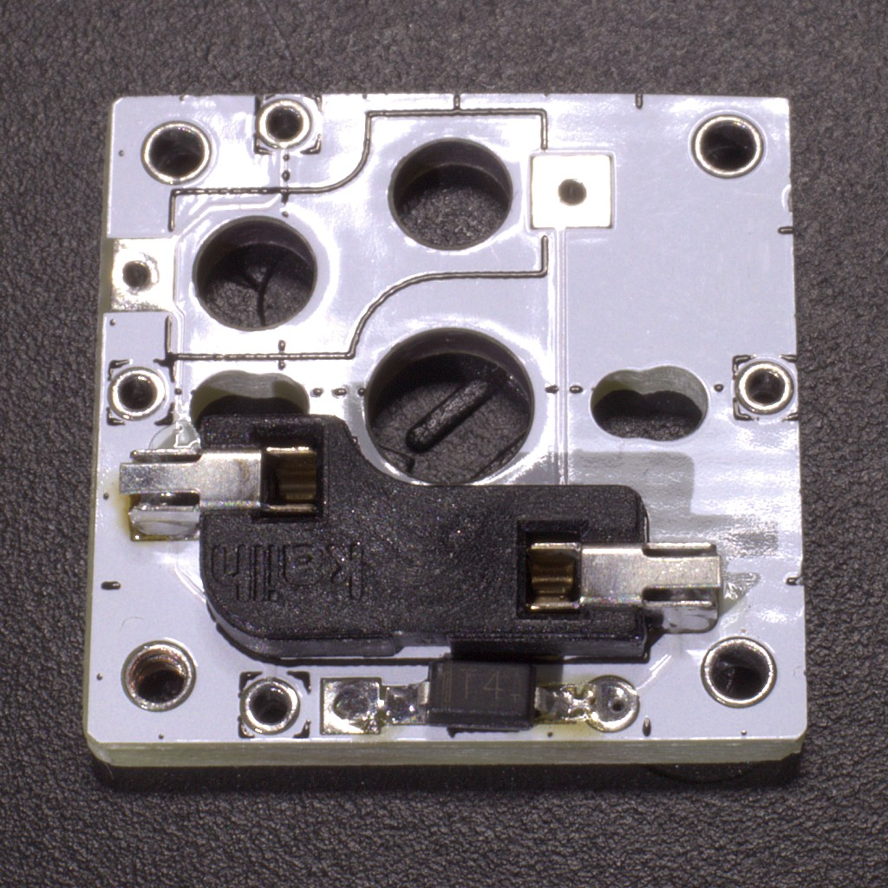
</a>
<a href="https://github.com/juhakaup/keyboards/blob/main/Cygnus%20v1.0/img/pcbth.jpg">
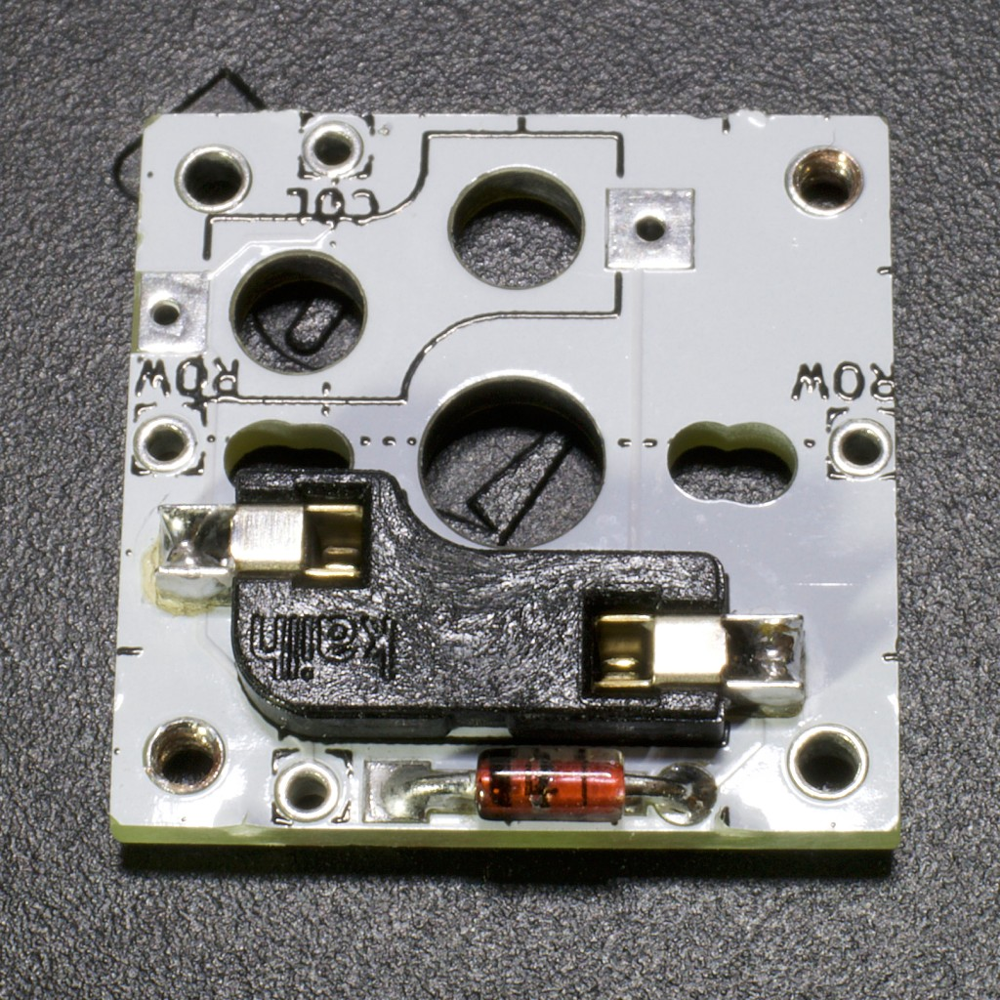
</a>
<a href="https://github.com/juhakaup/keyboards/blob/main/Cygnus%20v1.0/img/pcbth2.jpg">
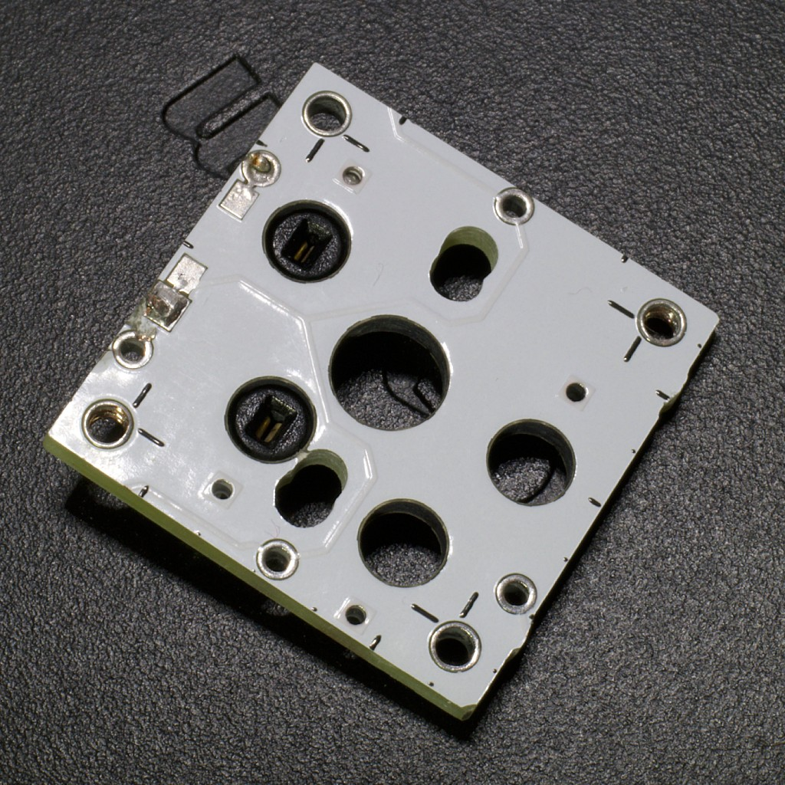
</a>
<a href="https://github.com/juhakaup/keyboards/blob/main/Cygnus%20v1.0/img/pcball.jpg">
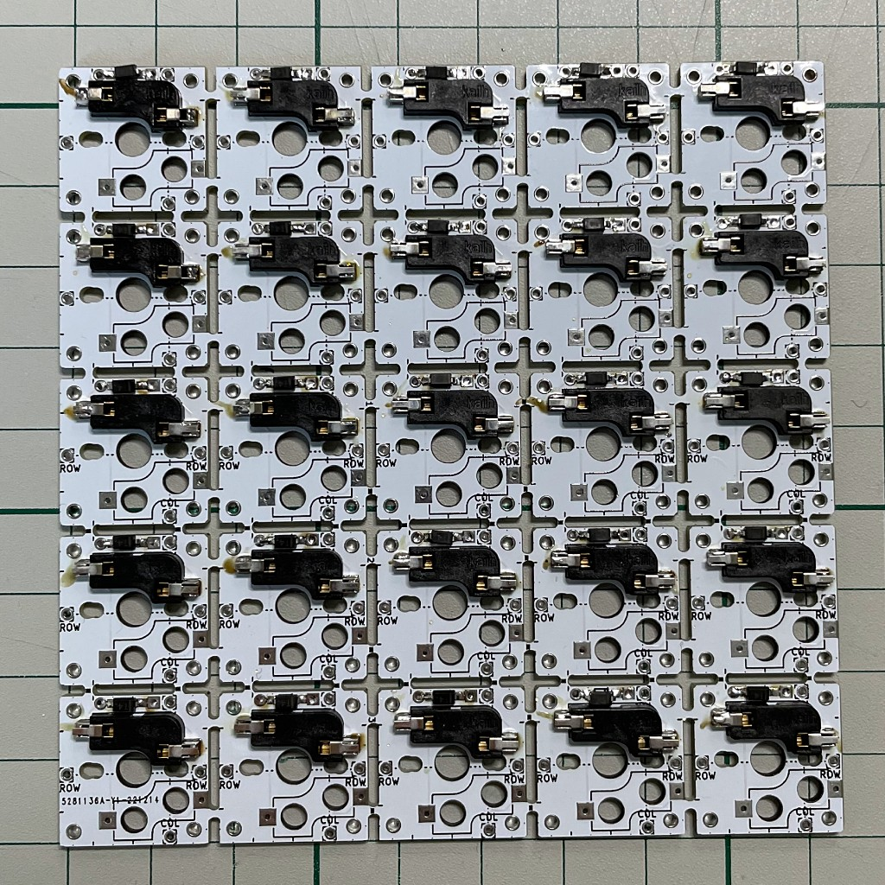
</a>

Attach the assembled pcbs to the case with the small screws. I've used two screws per pcb and that seems to be fine, but it doesn't hurt if you use all four screws. Some of the screw holes are obstructed, but you should be able to get at least two screws to each pcb. 

Inserting switches first and then placing the pcbs helps with the alignment and keeps the pcbs in place.

<a href="https://github.com/juhakaup/keyboards/blob/main/Cygnus%20v1.0/img/pcbscrews.jpg">
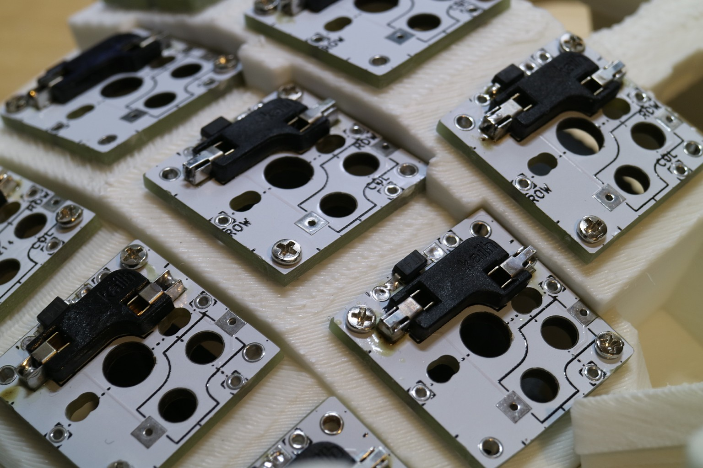
</a>

### Wiring the matrix
Next you need to connect the individual pcbs together to form the keyboard matrix. Attach the adjacent pcbs together from col to col and row to row. Solid core wire or something like diode legs work great here. 

The first thumb key gets connected to the first column on the key well etc. Check the wiring diagram to see how I wired my keyboard.

<a href="https://github.com/juhakaup/keyboards/blob/main/Cygnus%20v1.0/img/pcbwiring.jpg">
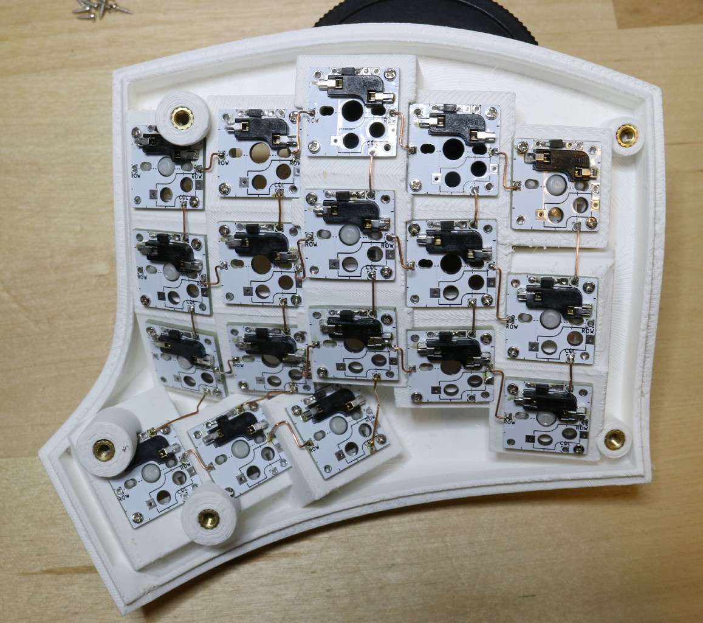
</a>
<a href="https://github.com/juhakaup/keyboards/blob/main/Cygnus%20v1.0/img/pcbwiring2.jpg">
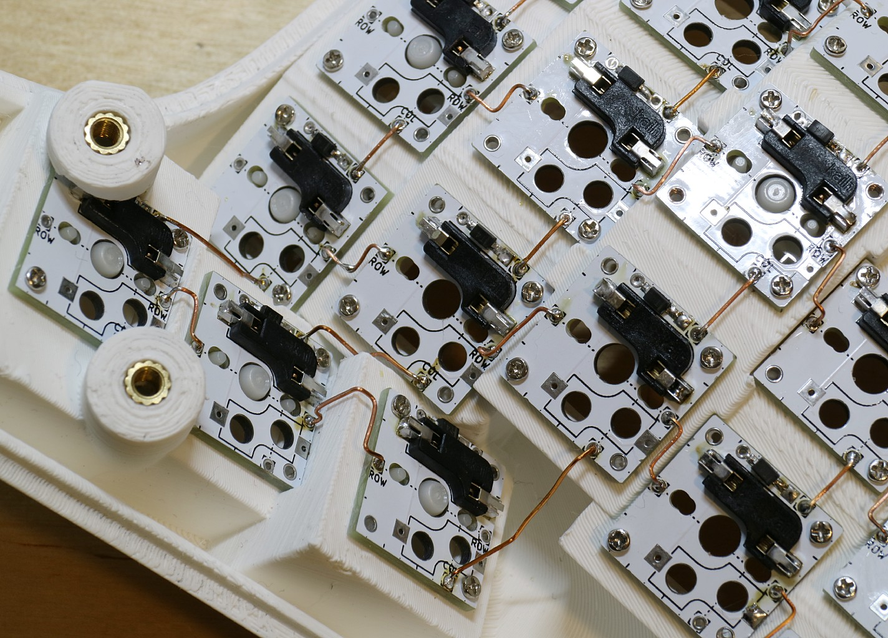
</a>
<a href="https://github.com/juhakaup/keyboards/blob/main/Cygnus%20v1.0/img/pcbwiring3.jpg">
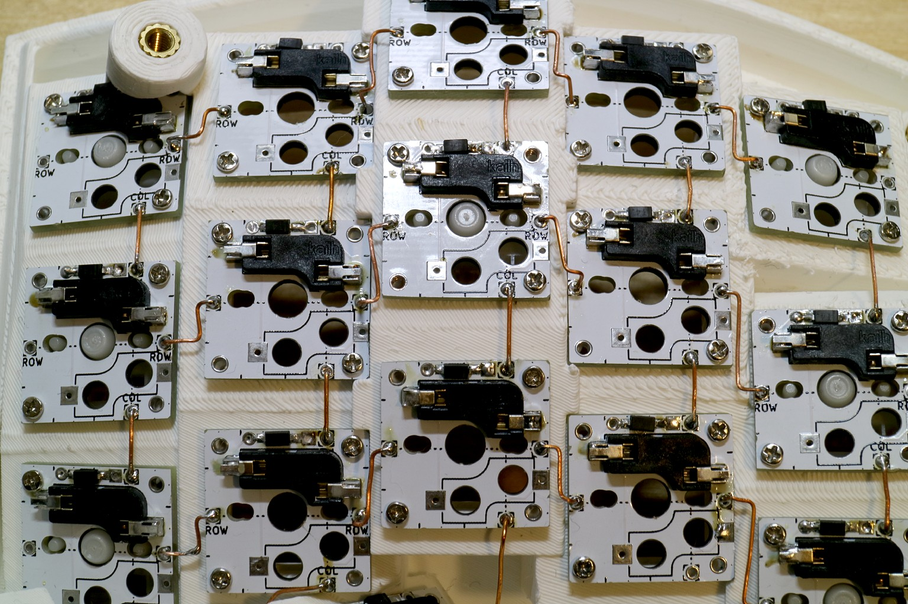
</a>

### Test the controller

Before wiring in the controller, it is a good idea to check that it can be programmed. 

Keeb.io has an extensive [guide](https://docs.keeb.io/flashing-firmware) on this subject.

### Wiring reset switch and trs socket

It's probably easier to wire the reset switch and TRS-socket at this point, before being tied to the rest of the keyboard.

One leg of the reset switch gets attached to the RST-pin and the other to GND-pin. 

The TRS-socket can be wired any way you like as long as it's the same on both sides, but I usually wire it so that the power is attached to the tip that gets connected last. This you don't accidentally send voltage through the other pins, if you forget to unplug the keyboard before attaching the trs-cable.

So I attach the tip to the VCC-pin and the ring to GND and finally the sleeve, carrying the data, gets attached to the RX-pin.

### Connecting the matrix

<a href="https://github.com/juhakaup/keyboards/blob/main/Cygnus%20v1.0/img/wiring.jpg">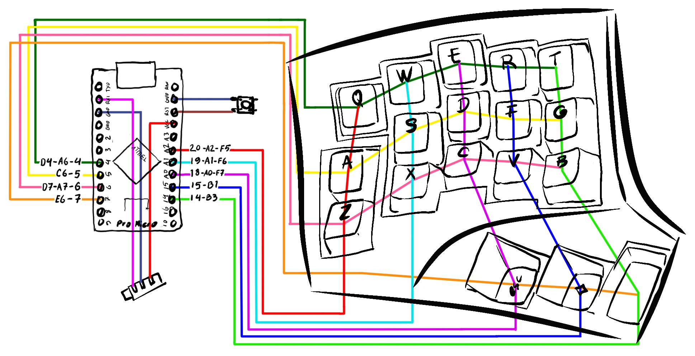</a>

I used thin 28awg wire for connecting the matrix. Basically you can attach the wires to any point on each row or column. I descided to attach the columns to the pads for the choc-switches since they are directly connected to the columns. For the rows I just used the row-holes.

<a href="https://github.com/juhakaup/keyboards/blob/main/Cygnus%20v1.0/img/wiringmatrix.jpg">
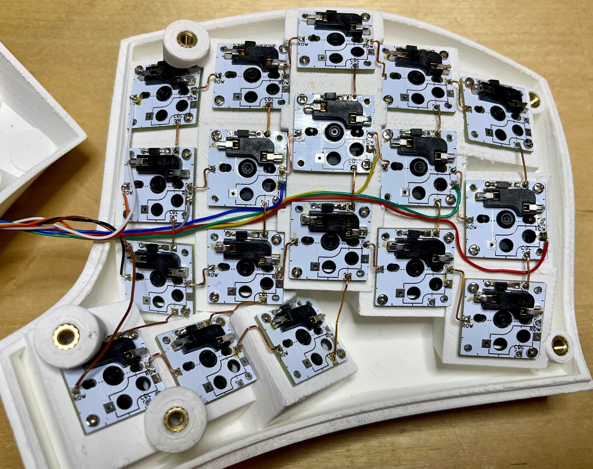
</a>

I wired the matrix to the controller the same way as in the [Corne-keyboard](https://github.com/foostan/crkbd). This means that you can use a Corne firmware and select Corne as target in online configurators. Another benefit is that hand wiring of the controller is easy as rows and columns are on opposide sides and in adjacent pins.

### Assembly

The reset switch is held in place with friction, so its just pushed in place. Push the TRS-socket to its hole, you probably need to trim one of the little nubs to get it to fully seat. After that attach the controller with the two brackets. It may be a bit tight depending on how you soldered the wires, but a little trimming can be done with an exacto knife. Finally attach the bracket from the bottom with the short  machine screw.

<a href="https://github.com/juhakaup/keyboards/blob/main/Cygnus%20v1.0/img/wiringcontroller.jpg">
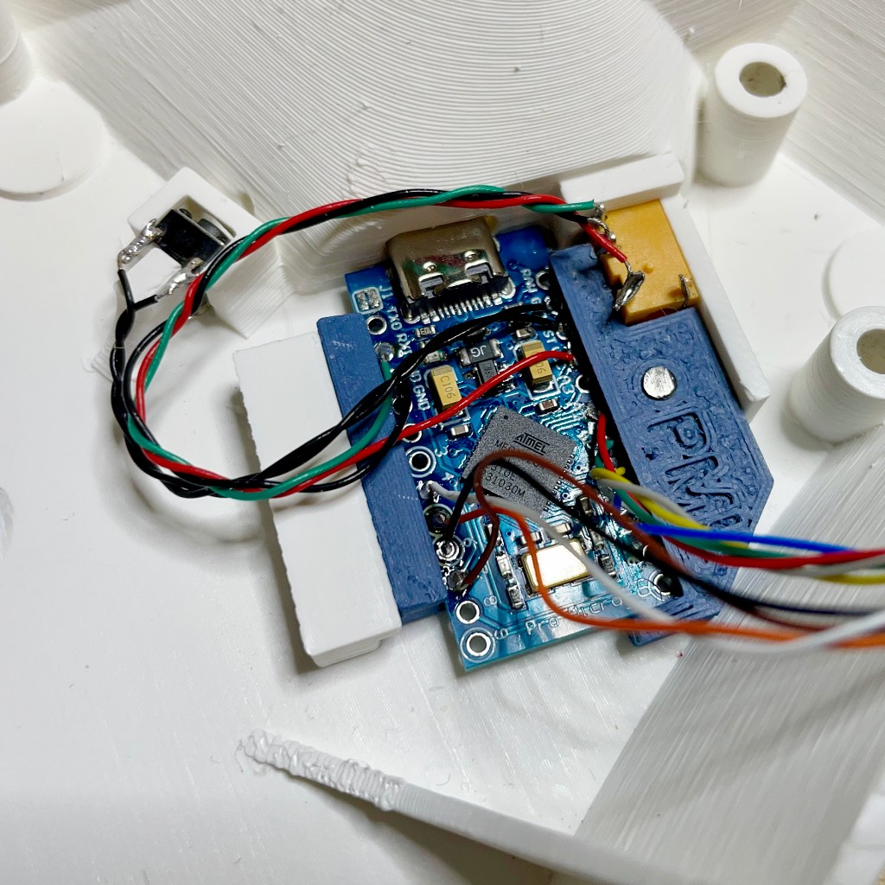
</a>
<a href="https://github.com/juhakaup/keyboards/blob/main/Cygnus%20v1.0/img/wiringall.jpg">
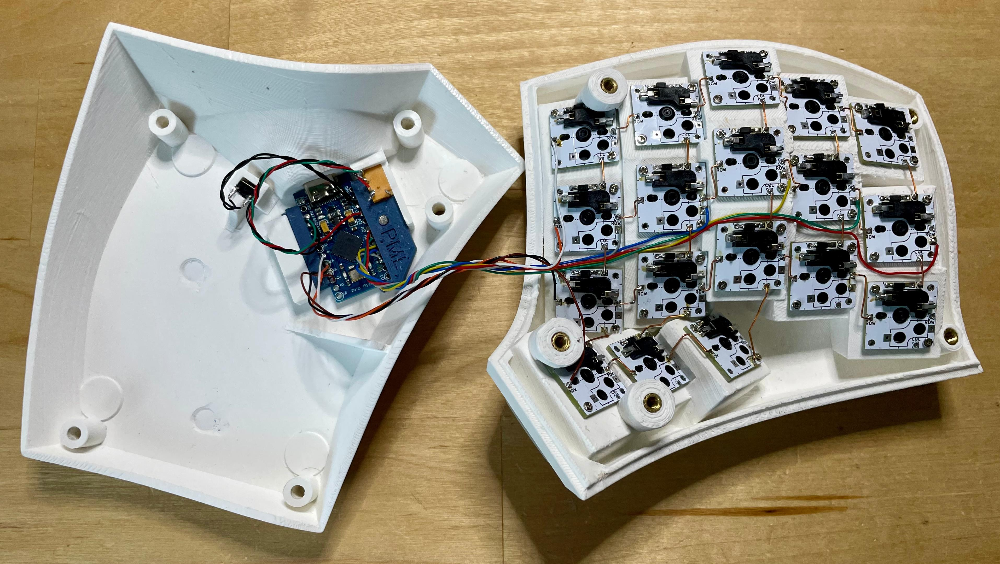
</a>

All that is left is to close the case, making sure no wires get pinched, attach the  the five screws. Add the feet, switches and keycaps and you're done.

<a href="https://github.com/juhakaup/keyboards/blob/main/Cygnus%20v1.0/img/done1.jpg">
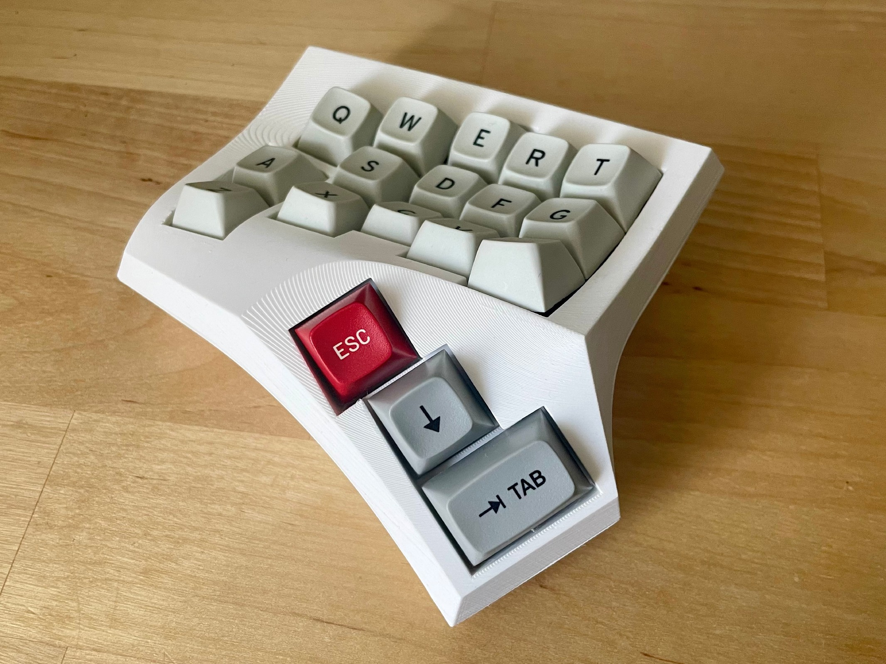
</a>
<a href="https://github.com/juhakaup/keyboards/blob/main/Cygnus%20v1.0/img/done2.jpg">
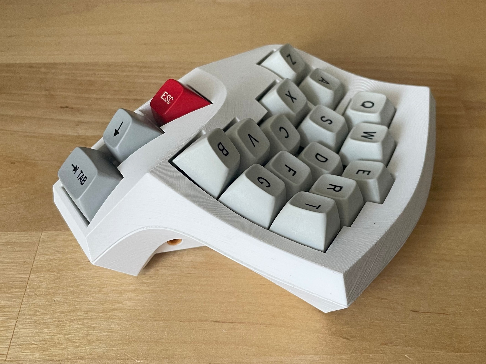
</a>
<a href="https://github.com/juhakaup/keyboards/blob/main/Cygnus%20v1.0/img/done3.jpg">
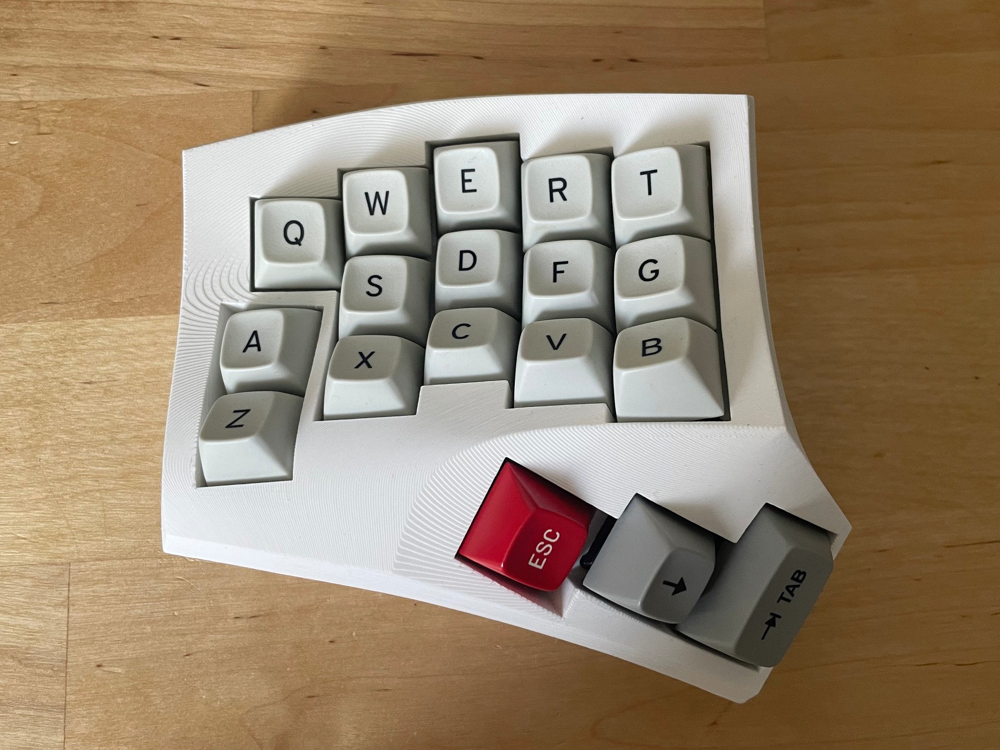
</a>
<a href="https://github.com/juhakaup/keyboards/blob/main/Cygnus%20v1.0/img/done4.jpg">
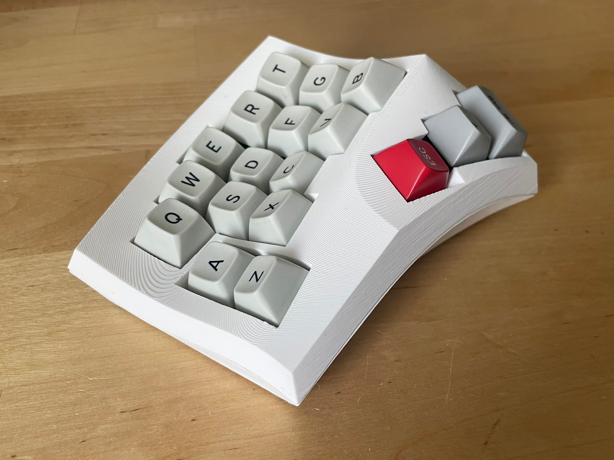
</a>
<a href="https://github.com/juhakaup/keyboards/blob/main/Cygnus%20v1.0/img/done5.jpg">
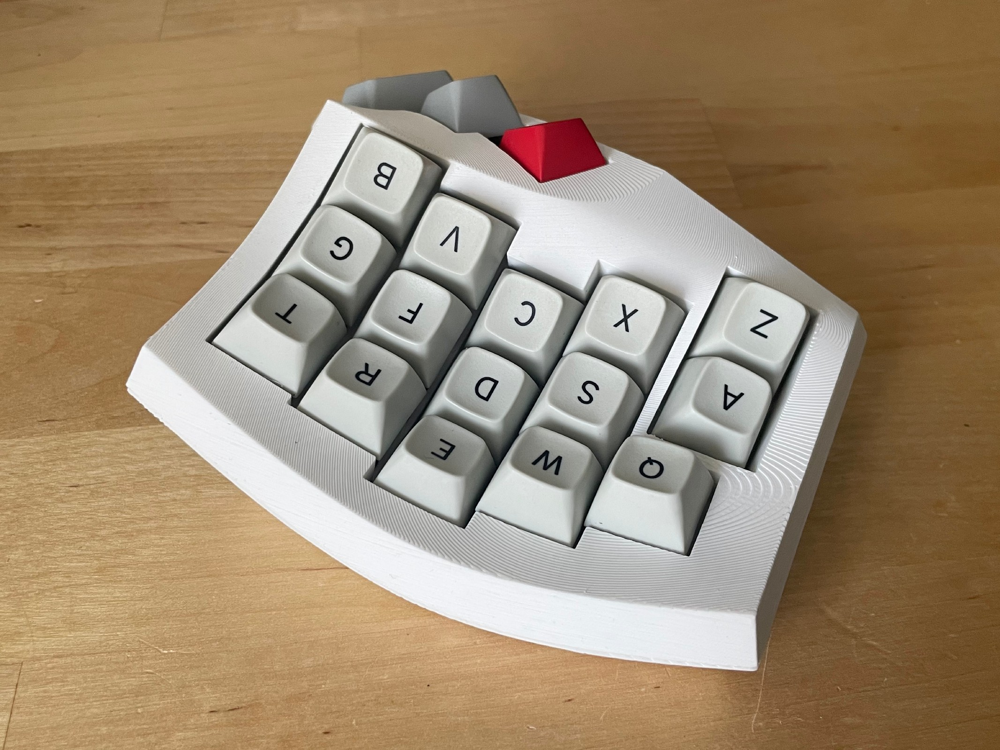
</a>
<a href="https://github.com/juhakaup/keyboards/blob/main/Cygnus%20v1.0/img/done6.jpg">
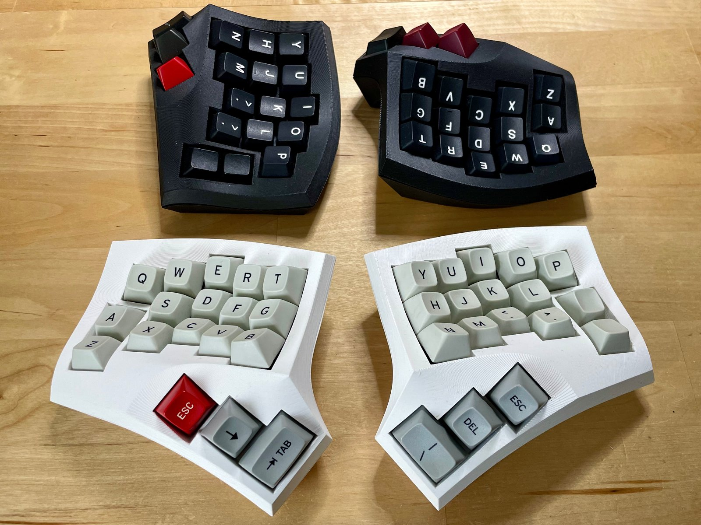
</a>

